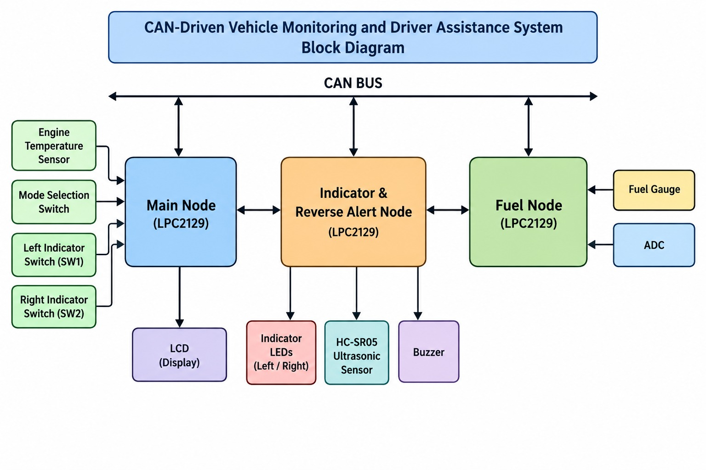

# CAN-Driven-Vehicle-Monitoring-and-Driver-Assistance-System
## Project Overview

The **CAN-Driven Vehicle Monitoring and Driver Assistance System** is a three-node embedded system designed to monitor important vehicle parameters and provide driver assistance features using **CAN (Controller Area Network) communication**.

The system monitors **fuel level and engine temperature**, controls vehicle indicators, detects obstacles during reverse operation, and displays real-time vehicle information on a centralized LCD dashboard.

The project is implemented using **LPC2129 microcontrollers** and CAN transceivers. The system is divided into three nodes: **Main Node, Indicator & Reverse Alert Node, and Fuel Node**. Each node performs a specific function and communicates with other nodes through the CAN bus.

The project demonstrates the practical use of **Embedded C, ADC, external interrupts, CAN communication, LCD interfacing, ultrasonic sensing, and sensor-based monitoring**.

---

## Features

- Real-time engine temperature monitoring
- Fuel percentage monitoring
- CAN-based communication between multiple nodes
- Forward and Reverse mode selection
- Left and Right indicator control
- Reverse obstacle detection
- SAFE, WARNING, and STOP alerts
- Buzzer-based reverse warning
- LCD-based vehicle status display
- External interrupt-based switch handling
- ADC-based fuel level measurement

---

## System Architecture

The system consists of three main nodes connected through the CAN communication bus:

```text
                    CAN BUS
                       |
        +--------------+--------------+
        |              |              |
        v              v              v
+---------------+ +---------------+ +---------------+
|   Main Node   | | Indicator &   | |   Fuel Node  |
|               | | Reverse Alert | |               |
| LPC2129       | | Node          | | LPC2129       |
|               | |               | |               |
| LCD           | | LPC2129       | | Fuel Gauge    |
| Temperature   | | HC-SR05       | | ADC           |
| Mode Switch   | | LEDs          | |               |
| Indicators    | | Buzzer        | |               |
+---------------+ +---------------+ +---------------+
```

## CAN Communication Flow

```text
                         CAN BUS
                            |
        +-------------------+-------------------+
        |                   |                   |
        v                   v                   v
   MAIN NODE          INDICATOR &            FUEL NODE
                      REVERSE ALERT
        |                   |                   |
   +----+----+          +---+---+          +----+----+
   |    |    |          |   |   |          |         |
   v    v    v          v   v   v          v         v
 LCD  Temp  Switches   LED Buzzer HC-SR05  Fuel     ADC
                                            Gauge

The three nodes communicate through the CAN bus while each node interfaces with its dedicated peripherals. This distributed architecture allows vehicle monitoring, indicator control, fuel monitoring, and reverse obstacle detection to operate together as a single system.

## Block Diagram

<h2>Block Diagram</h2>


